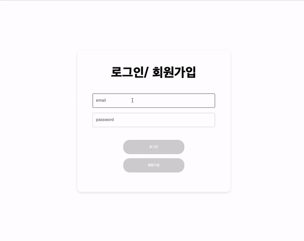
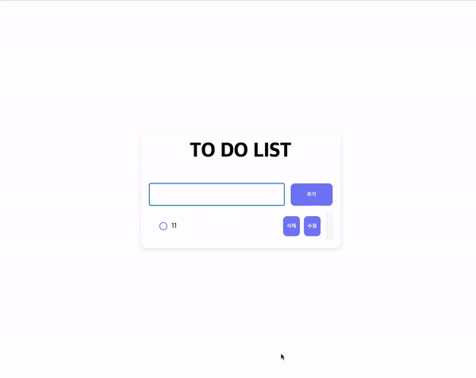

## 개요 

원티드에서 진행한 프리온보딩 프론트엔드 인턴십 사전 과제를 구현한 프로젝트 입니다. 간단한 로그인, 회원가입과 TODO의 CRUD를 구현하는 과제입니다.


## 프로젝트 실행 방법

``` 
yarn install 
yarn start 
```

## 프로젝트 배포 주소 

https://dpdz0g9deuqiu.cloudfront.net/

## 프로젝트 구조
```
📦src
 ┣ 📂api                            // api를 모아 놓은 폴더입니다.
 ┃ ┣ 📜auth.ts
 ┃ ┗ 📜todo.ts
 ┣ 📂components     
 ┃ ┣ 📂common                       // 재사용되는 컴포넌트를 모아 놓는 폴더입니다.
 ┃ ┃ ┣ 📜inputWithLabel.style.ts
 ┃ ┃ ┣ 📜inputWithLabel.tsx
 ┃ ┃ ┣ 📜todoInput.style.ts
 ┃ ┃ ┗ 📜todoInput.tsx
 ┃ ┗ 📂unit                         // 각 기능의 메인 로직을 수행하는 컴포넌트, ui를 담당하는 컴포넌트를 모아놓는 폴더입니다.
 ┃ ┃ ┣ 📂auth                       // 인증, 인가와 관련된 컴포넌트를 모아놓는 폴더입니다.
 ┃ ┃ ┃ ┣ 📜auth.container.tsx       
 ┃ ┃ ┃ ┣ 📜auth.presenter.tsx
 ┃ ┃ ┃ ┗ 📜auth.style.ts
 ┃ ┃ ┗ 📂todo                       // todo와 관련된 컴포넌트를 모아놓는 폴더입니다.
 ┃ ┃ ┃ ┣ 📂item
 ┃ ┃ ┃ ┃ ┣ 📜todoItem.container.tsx
 ┃ ┃ ┃ ┃ ┣ 📜todoItem.presenter.tsx
 ┃ ┃ ┃ ┃ ┗ 📜todoItem.style.ts
 ┃ ┃ ┃ ┣ 📜todoList.container.tsx
 ┃ ┃ ┃ ┣ 📜todoList.presenter.tsx
 ┃ ┃ ┃ ┗ 📜todoList.style.ts
 ┣ 📂lib                            // util 성격을 갖는 기능을 모아놓는 폴더입니다.
 ┃ ┗ 📜localstorage.ts
 ┣ 📂pages                          // 페이지 컴포넌트를 모아놓는 폴더입니다.
 ┃ ┣ 📜loginPage.tsx
 ┃ ┗ 📜todoListPage.tsx
 ┣ 📂types
 ┃ ┣ 📜auth.ts
 ┃ ┗ 📜todo.ts
 ┣ 📜App.tsx
 ┣ 📜index.tsx
 ┣ 📜router.tsx                     // 라우터를 정의하는 파일입니다.
```


## 구조 설명

* 관심사의 분리와 컴포넌트의 재사용성에 집중하여 프로젝트를 구현했습니다. 
* 기능 측면에선 관심사를 auth와 todo로 분리했고, 기술 측면에선 크게 통신, UI, util, 라우터, 페이지로 분리했습니다.

### 라우터 
* 접근할 수 있는 경로를 router.tsx에서 관리합니다. 
* createBrowserRouter를 사용하여 해당 경로에서 어떤 페이지를 보여줄 것인지 정의 합니다. 
* router.tsx에서 정의된 router는 index.tsx에서 <RouterProvider />의 router 속성에 사용됩니다.

```typescript

// router.tsx

export const router = createBrowserRouter(
  [
    {
      path: "/",
      element: <LoginPage />,
    },
    {
      path: "/todo",
      element: <TodoListPage />,
    },
  ],
  { basename: process.env.PUBLIC_URL }
);

```

```typescript
// index.tsx

const root = ReactDOM.createRoot(document.getElementById("root") as HTMLElement);

root.render(<RouterProvider router={router} />);
```

### 페이지 
* 다음 2가지 측면에서 container 컴포넌트를 바로 사용하는 것보다 페이지 컴포넌트를 중간에 두어 사용하는 것이 낫다고 판단되어 페이지 컴포넌트를 구현했습니다.  

1. 페이지와 관련된 분기 처리   
페이지 컴포넌트를 사용하지 않고 바로 container 컴포넌트를 사용할 경우 container 컴포넌트에서 todo와 관련된 로직 이외에 인가와 관련된 로직(로컬 스토리지에 accessToken이 있는지 확인하는 작업)이 포함되어야 합니다. 그렇기 때문에 페이지 접근 가능 여부를 판단하는 로직을 페이지 컴포넌트로 이동시켜 관심사가 분리 될 수 있도록 구현했습니다.

```typescript
// todoListPage.tsx

export default function TodoListPage() {
  const navigate = useNavigate();

  useEffect(() => {
    if (!getFromLocal("accessToken")) {
      return navigate("/");
    }
  }, [navigate]);

  return <TodoListContainer />;
}
```

2. router.tsx에서 사용될 때 가독성  
router.tsx는 페이지와 경로에 관한 작업을 하는 곳이기 때문에 Container 보다는 Page를 사용하는 것이 더 명확한 의미를 전달한다고 생각했습니다.

### 통신 
* 통신과 관련하여 통신하는 부분과 사용하는 부분을 분리하였습니다.
* api를 호출하는 부분은 api 폴더의 각각 기능 파일(auth, todo)에 함수로 구현했습니다.
* 사용자의 입력값을 받아 api 메소드를 호출하는 로직은 Container 컴포넌트에 구현했습니다.  
* 사용자의 요청으로 api를 호출하기 때문에 UI컴포넌트를 자식 컴포넌트로 갖고 있습니다.

  * AuthContainer : 로그인과 회원가입과 관련된 api함수를 호출합니다.
  * TodoListContainer : 투두 리스트 목록 불러오기, Todo 생성 api 함수를 호출합니다. Todo 생성은 리스트의 길이 변화에 영향을 주기 때문에 TodoListContianer에서 호출하는 것으로 구현했습니다.
  * TodoItemContainer : 투두 아이템의 수정, 삭제 api 함수를 호출합니다.

### UI
* 화면에 그리는 작업을 하는 컴포넌트입니다. 이모션을 사용하여 정의한 스타일을 불러와 화면에 표시합니다.
* input과 같이 반복적으로 재사용되는 부분은 따로 common에 작은 단위로 분리하여 구현했습니다.

### util
* 로컬 스토리지에 접근해서 값을 저장하고, 불러오는 작업을 하는 기능을 따로 파일로 빼서 관리할 수 있도록 구현했습니다.

## 시연영상

### 로그인 및 회원가입


### 투두 리스트 목록, 투두 생성, 수정, 삭제


